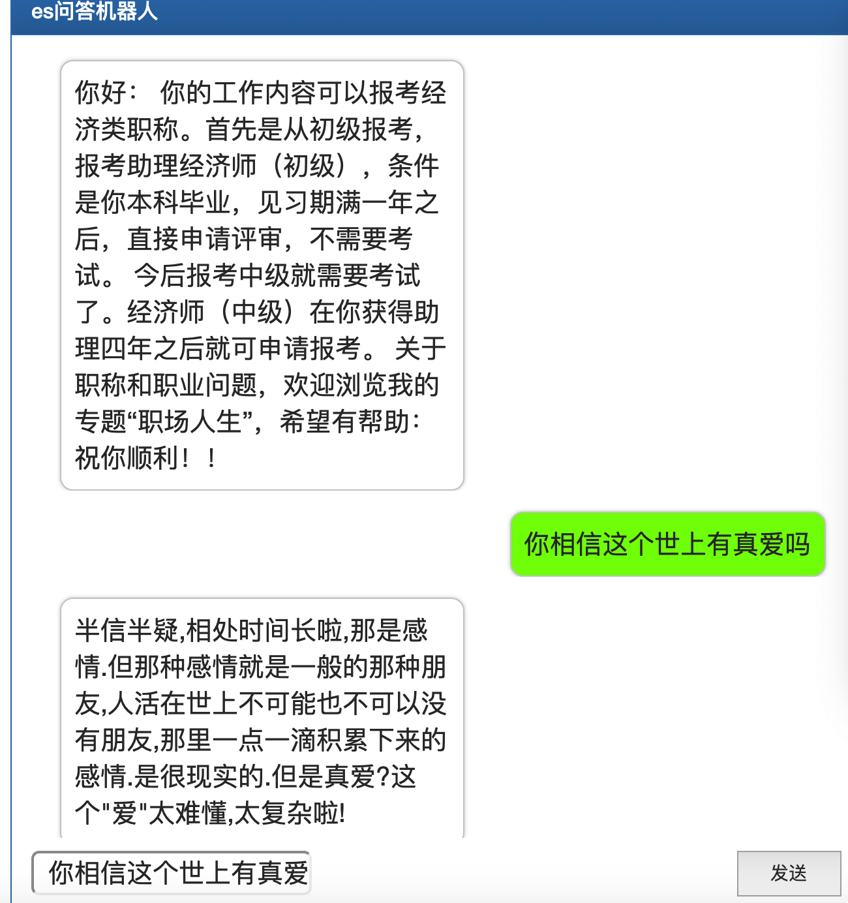

# ES 问答机器人

## 安装 es

- https://www.elastic.co/cn/
- Download and unzip Elastic search
- ./bin/elasticsearch  -d -p pid

## 创建索引/导入数据

参考 es_util.py

若没有初始化，将 flag 只为 true

搭建好，并导入数据后，就可以直接查询了

## flask 部署

运行 app.py

效果如下：（很粗糙，需要重排序、找最佳相似问题、答案）

## TODO

右边 解析结果内容（如同时显示相关问题、相关答案）