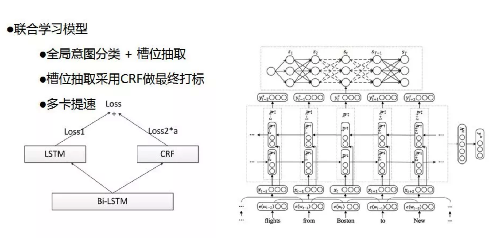
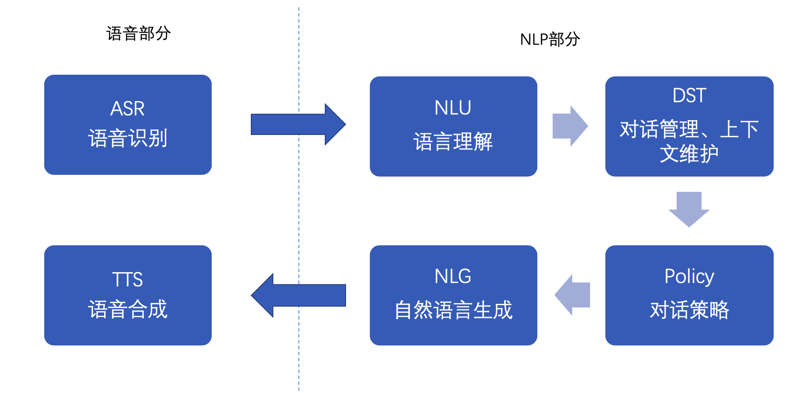
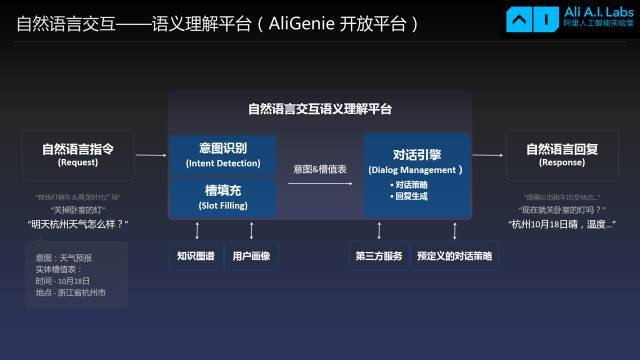
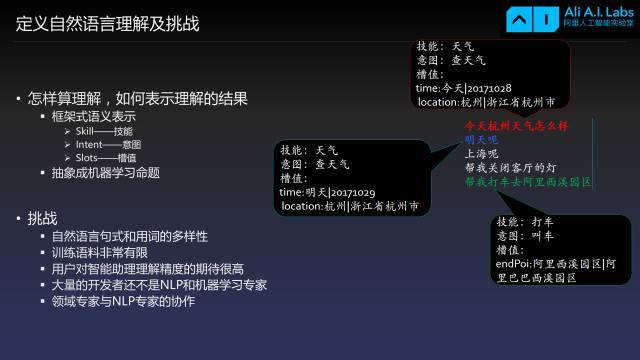
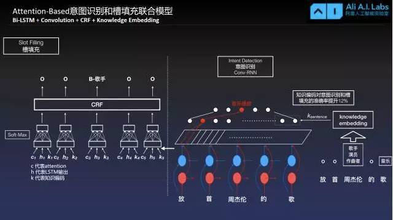

# Dialogue System

简单的对话系统 demo-_-

这个公众号，写的不错
[猎户星空NLP技术进展及产品应用](https://mp.weixin.qq.com/s?__biz=MzU1NTMyOTI4Mw==&mid=2247486626&idx=1&sn=a537f1d9bbe5a686da37febbde17433b&chksm=fbd4bececca337d86a43d374570ff8e692d401bf2f5454101bc95bdb2253e6785a3ee68d56f5&scene=21#wechat_redirect)

下面部分摘取上面的部分内容
```
输入是query/ASR解码路径/context/用户信息/语境等内容，首先在基础NLP工作中进行query预处理/词法分析/句法分析/实体识别和消歧/短语识别/实体纠错/指代消解等。之后进行领域意图分类，利用浅层语法分析结果判断用户在哪个领域以及他在这个领域中到底在问哪个方面的问题，接下来进行语义槽抽取模块，在当前领域下对用户query的槽位进行抽取，对领域和槽位进行综合管理得出用户真正的意图做一个结构化的输出。

这里我们基于LSTM做了一个模型层面的意图和领域分类模型，输入是两维特征：字向量和实体识别特征，作为所有意图分类模型基础输入。模型由一个双向的LSTM加一个单向的LSTM构成，最后通过softmax做一个领域的选择。意图分类同样基于此模型，在领域分类上准确率可以达到93%，在意图分类上准确率可以达到96%。

槽位抽取分为两种，一是基于「pattern」的抽取，二是基于「模型」的抽取，模型采用比较成熟的双向LSTM加CRF，线上总体准确率可达92%。

NLP方向的一些实用建议：


1）冷启动阶段只能文法规则先上 ；

2）一定关注线上真实用户的数据情况，关注badcase ；

3）一定要增加运营干预手段 ；

4）一定要强化对资源数据的清洗和挖掘理解 ；

5）线上数据标注+模型，提升整体性能 。
```

上面的意图识别与槽填充可以同时进行



对话系统系统大致分为以下几块



在这里，主要介绍以下三种形式的对话设计：

## QA

一问一答，主要有一下几种形式。1）基于检索式QA系统；2）基于知识图谱的QA系统；3)文档阅读理解。这里介绍基于知识图谱的形式，如：
- 实体检索-
    
    ```
    姚明是谁
    佟大为是谁
    ```
- 实体的属性检索-

    ```
    姚明是在哪儿出生的
    佟大为有多高
    ```
- 多跳查询-

    ```
    姚明的女儿的母亲是谁
    姚明的女儿的母亲有多高
    ```

对于上述场景的QA，可以基于【**elastic search**】搭建一个简易的知识问答系统。
 这部分，主要参考http://openkg.cn/tool/elasticsearch-kbqa


## CHAT

闲聊，这一块没有明确的指标来评价。作为开放域，答案是不确定的、不唯一的。目的在于陪聊，娱乐用户，对于一些儿童教育类的，也可以作为【**行为指导**】。
如以下的闲聊模板例子
```
{"questions": ["你听到什么了?"], "answers": ["听见你的心声。", "什么都没听见呀"]}
{"questions": ["你很皮啊"], "answers": ["我皮我开心。", "不容易啊，终于意识到了！", "调皮是我的天性，爱我你怕了吗？"]}
```
闲聊对话，没有一个很好的评价标准，它的答案本身就是开放式的，难以评估！（机器翻译 使用 BLEU ）因此还得靠用户人工评价。

实现方法：
- 基于 AIML 模板的技术
- 基于 QA pairs 语料的技术
- 基于 seq2seq 训练聊天机器人（还不是很成熟）


## Task Orient

任务型系统主要帮助人们完成确定的任务（例如，预订机票、火车票、酒店, 查看天气，播放音乐，讲笑话等等）。\
这个是阿里[天猫精灵](http://www.sohu.com/a/206109679_473283)的相关介绍与解读\
接下来是盗图时间：-_-







## 说明

语义理解、对话管理、策略。这几块是难点，也是最核心的。

不同的意图，对于的策略也会不同：

Q：周杰伦是谁？

在QA领域：\
A：[周杰伦（Jay Chou），1979年1月18日出生于台湾省新北市，中国台湾流行乐男歌手、音乐人、演员、导演、编剧、监制、商人。](https://baike.baidu.com/item/%E5%91%A8%E6%9D%B0%E4%BC%A6/129156?fr=aladdin)

但在CHAT领域可以有不同回答方式：\
A-1：周杰伦是台湾流行乐男歌手！`正面回答/类似于QA`\
A-2：他是我最最最喜欢的歌手！`侧面回答-个人喜好/观点`\
A-3：我很喜欢他的 烟花易冷 `侧面回答-个人喜好/观点`！


## 附录

这里小插一段，这位[小哥哥(大佬)](https://github.com/qhduan/ConversationalRobotDesign)对[**对话系统**]做了个调研，综述，入门参考价值很高。
学习一下：
```
！ 易用、易学的QA Pairs管理与查询引擎
用于机器人管理者简单定义类似FAQ的问答，例如“怎么退货”这种有一个固定回答问题
！ 易用、易学的对话模板生成管理方法（用于生成可能的用户说的话）
机器人管理者用于生成针对对话系统（任务）的对话
！ 足够使用的NLU部件
内部需要包括其他各种基本组件，例如intent classification，entity recognization
！ 当机器人不准确、失效时，人工代替解决方案
最好能即时接入人工，给用户接入人工的手段，即时评价当前对话质量，最低要求是提供其他人工渠道：电话、邮箱、IM
足够使用的对话状态跟踪部件与对话策略部件
dialogue state tracker & dialogue policy
易用、易学的自然语言生成模板方法（用于生成机器人的回复）
根据当前状态，生成对应回复所需要的模板系统
用户行为模拟程序与系统评价程序
行为模拟可以用于强化学习，就算不用强化学习，这套系统也是一套标准的集成测试系统
良好的自动用户反馈、评价机制
用户评价机器人好坏、反馈结果、与用户沟通联系
一个良好的、易懂的面向开发人员文档
用于帮助专业人员构建更详细、自定义的机器人
一个良好的、易懂的面向非专业人员培训文档
用户普及知识，做简单的非专业训练，让他能够很好的管理基本问答、知识库
～ 基于某种UI（例如web）的高级图形管理界面
方便非专业人员使用
～ 自动的训练程序，例如基于强化学习的
未测试
～ 足够覆盖基本问答的chatbot引擎
回答一些非常基本机器人，你是谁，你从哪来，你到哪去，用于最基本的调戏、使用帮助目的
～ 高效的Knowledge-based QA问答引擎
用于更方便的回答例如，这个东西保修几年，这双鞋有多大码的，这种更细节的知识问题
～ 一个简易的知识库构建与对接系统（如果需要Knowledge-based QA问答引擎的话）
～ 较准确的Retrival-based QA问答引擎
例如用于一些百科知识问答，某些特定领域的文档问答
～～ 人类情绪分析部件（NLU中）
～～ 一个基于Seq2Seq的chatbot引擎
～～ 语音识别
～～ 人工语言合成

！：必须
～：部分场景可有可无
～～：可能需要忽略的

```

*开源实现*

- 一个开源的DS deepmipt/DeepPavlov

- 比较简单的机器人ChatterBot

- 一个开源的QA系统，里面那个论文列表不错 castorini/BuboQA

*数据集*

https://research.fb.com/downloads/babi/

https://www.microsoft.com/en-us/research/event/dialog-state-tracking-challenge/

http://www.camdial.org/pydial/

*删除历史commit*
```bash
1:
 git checkout --orphan latest_branch & git add -A & git commit -am "commit message" & git branch -D master & git branch -m master & git push -f origin master
```
